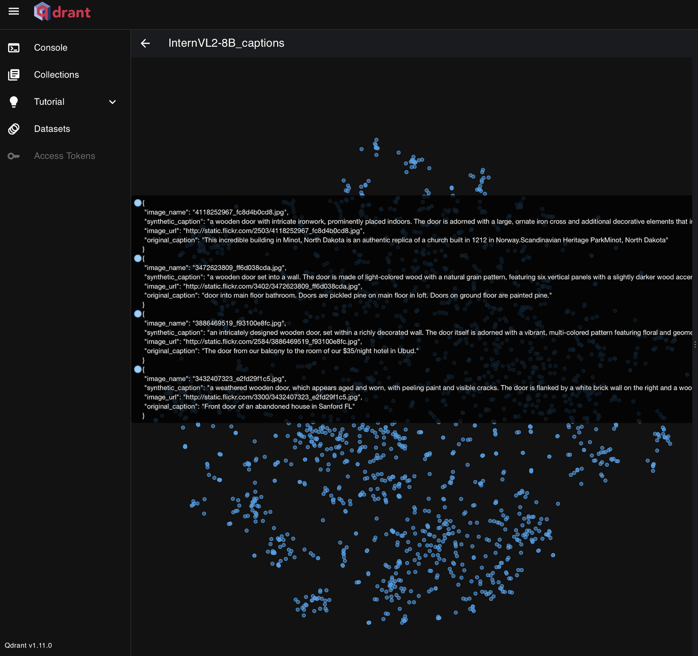

# Synthetic Data

## Why?
Training a model is expensive, and the results heavily rely on the quality of the input data. Enhancing the quality of the input data will yield superior results.

Deep Learning (DL) models generate predictions based on patterns extracted from data, which are inherently partial representations of the real world. As a result, 
`DL outputs are approximations of reality.` To enhance the model's ability to capture the complexity and diversity of the reality, incorporating multiple data modalities, as exemplified by Vision-Language Models (VLMs) that combine visual and textual information, can lead to a better representation of the true reality distribution. [Source: [The Platonic Representation Hypothesis](https://arxiv.org/abs/2405.07987)]

Improving both the quality of images and their paired captions is essential for training effective Vision-Language Models. Curated datasets play a significant role in this process, enabling models to better capture the complexities and nuances of the true reality distribution. 

In this project, we assume the quality of the images is suitable for training and `focus on improving the quality of their captions`.

## How?

The release of ChatGPT and similar large language models (LLMs) have highlighted a tendency on the quality of Common Crawl data, demonstrating the potential of synthetic data to improve AI models. [Source: [The FineWeb Datasets: Decanting the Web for the Finest Text Data at Scale](https://arxiv.org/abs/2406.17557])]


### Synthetic data from VLM

`We focus on leveraging synthetic data from vision-language models (VLMs)`, such as [CogVLM2-llama3-chat-19B](https://huggingface.co/THUDM/cogvlm2-llama3-chat-19B), to enhance image captions in existing datasets, specifically the [1M SBU Captioned Photo Dataset](https://huggingface.co/datasets/vicenteor/sbu_captions) a collection of images and their associated captions from Flickr to demostrate scalability. By leveraging the VLM's understanding of both images and text, we can generate captions that are more detailed, informative, or contextually relevant, ultimately improving the quality and diversity of training data for AI models.

- Results

    
    
    > Caption for image 2591505632_e6241f1ae7.jpg with URL http://static.flickr.com/3122/2591505632_e6241f1ae7.jpg: This image showcases a large, light-colored wall with a textured surface that resembles a concrete or stone facade. The wall is adorned with a vertically aligned, metallic sign that reads "TIFFANY & CO." Below the sign, on the left side of the image, there's a small, dark-colored object that appears to be a water bottle. The overall setting suggests an urban environment, possibly outside a high-end retail store. The mood conveyed by the image is one of minimalism and modern design. 
    
    > Original caption: A bottle in the main door of Tiffany & Co.

### Classifier

Upon obtaining the synthetic captions from the VLM, `we checked our assumption that these generated captions are more accurate than the originals`, fetched from the [1M SBU Captioned Photo Dataset](https://huggingface.co/datasets/vicenteor/sbu_captions), by performing a caption quality classification. We decided to guide our classification using the [CLIP](https://github.com/openai/CLIP) (Contrastive Language-Image Pre-Training) model, a neural network trained on a variety of (image, text) pairs. It can interpret natural language instructions to identify the most relevant text snippet for a given image, without requiring direct optimization for that specific task. By addressing the cosine similarity between the captions predicted by CLIP and our generated captions, we can discern if our captions are richer in terms of information retained from the image. Specifically, we compute the similarity between the image embedding and the embedding of the generated caption. This allows us to evaluate how well our captions align with CLIP’s predictions, helping us determine whether the generated captions effectively capture the information present in the image.

- Results

  

  > The results from CLIP classifier applied to a random subset of 1000 samples, highlighting the `better alignment of synthetic captions`:
  >
  > - For every probability threshold (70%, 80%, 90%), the count of synthetic captions surpassing that threshold is significantly higher than the count of original captions.
  >
  > - This difference becomes even more pronounced at higher thresholds.
  >
  >   
  >
  > **Note:** We should be aware of the constraints imposed by CLIP regarding token limits. CLIP requires truncating prompts to a maximum of 77 tokens.

## Research on Synthetic Captions

Given the strong alignment of synthetic captions captured by the CLIP classifier, we built upon these promising outcomes by conducting additional research focused on evaluating the performance of alternative VLMs for generating captions. Specifically, we used [InternVL2-8B](https://huggingface.co/OpenGVLab/InternVL2-8B), an efficient model with robust performance in visual-language tasks.

- Results

  
  
  > When comparing the original caption with another VLM, specifically InterVL2-8B, the alignment with synthetic captions is still preserved. Furthermore, the results show an improvement across all thresholds when compared to the previous VLM model (CogVLM2-19B), particularly in relation to InterVL2-8B:
  >
  > - For thresholds above 70%, InterVL2-8B shows a 17.96% improvement over CogVLM2-19B when comparing each model's performance against user-generated captions.
  >
  > - For thresholds above 80%, InterVL2-8B shows a 15.49% improvement over CogVLM2-19B when comparing each model's performance against user-generated captions.
  >
  > - For thresholds above 90%, InterVL2-8B shows a 18.64% improvement over CogVLM2-19B when comparing each model's performance against user-generated captions.
  >
  >   
  >
  > **Note:** If one caption has a probability above 50%, it means that the model used as a classifier (CLIP) considers that caption more likely to accurately describe the image compared to the other caption. Graphs showing probabilities above 70%, 80%, and 90% can help us identify where one model outperforms another. The graphs plot the cases where confidence exceeds 70% with respect to the CLIP model. Since we are comparing two captions, the numbers corresponds to different images. Therefore, the sum of cases above the 70% threshold cannot exceed 1000. 80% and 90% threshold are shown for added granularity. So, the images not counted in this graph are easily describable by both captions, and we can avoid focusing on them.

### Vector Database

Additionally, we use a `vector database to embed the caption for each image`, facilitating further processing like deduplication based on similarity embeddings. This setup also allows us to perform queries, enabling the creation of subsets from the curated dataset with the improved captions.

- Results

  - **Retriving caption by Image Name:** (Result from the CogVLM2-19B_captions collection)

    Retrieved caption for 2591505632_e6241f1ae7.jpg: This image showcases a large, light-colored wall with a textured surface that resembles a concrete or stone facade. The wall is adorned with a vertically aligned, metallic sign that reads "TIFFANY & CO." Below the sign, on the left side of the image, there's a small, dark-colored object that appears to be a water bottle. The overall setting suggests an urban environment, possibly outside a high-end retail store. The mood conveyed by the image is one of minimalism and modern design.

  - **Clustering**: (Result from the  InterVL2-8B_captions collection)

    

## Hardware

All computations were performed on a single `1x A100 SXM4 80GB GPU`. As a relevant metrics:

- When we used CogVLM2-19B to generated the synthetic captions:
  - Each caption took 1.05 seconds to complete (2h 55min per 10,000 captions). 
  - Besides, all batches processed for Qdrant DB in 110.95 seconds.
- When we used InterVL2-8B to generated the synthetic captions:
  - Each caption took 0.45 seconds to complete (1h 15min per 10,000 captions). 
  - Besides, all batches processed for Qdrant DB in 116.40 seconds.

To wrap up, the InterVL2-8B model demonstrated a 57.14% improvement in time efficiency with this setup compared to CogVLM2-19B, along with approximately 17% improvement per threshold at 70%, 80%, and 90% when comparing each model's performance against user-generated captions from the [1M SBU Captioned Photo Dataset](https://huggingface.co/datasets/vicenteor/sbu_captions) .

## How to use

To get started, first clone our [repo](https://github.com/alexferdg/data-quality-engine) from github by running the following command:
```shell
git clone https://github.com/alexferdg/data-quality-engine.git
cd data-quality-engine
```

To use the repository, you should mount a volume in the folder where you want to persist the Qdrant outputs. Additionally, the post-processing script, `spark_straightforward_captions.py`, requires a volume that already contains a collection to perform the transformation. Be sure to select the correct path for it. The final datasets obtained are stored in the `databases` folder. This folder contains separate Qdrant databases, each with a single collection. You can browse them using qdrant_web_ui.py and selecting the desired database-collection.

> **Note:** Some scripts create multiple collections in the instantiated Qdrant database. To comply with GitHub's 100MB file size limit, these collections are stored separately in the `databases` folder.

### Visualize Qdrant DB data 

To visualize data from Qdrant using the WebUI dashboard, navigate to the captioning-data-engine directory and run the qdrant_web_ui.py script to access the Qdrant WebUI dashboard:

```shell
cd captioning-data-engine
python qdrant_web_ui.py
```


## CheckList ✅

- [x] Captioning via VLM
- [x] Verify synthetic captions using CLIP as a caption quality classifier
- [x] Apply the pipeline to a larger population
- [x] Straightforward description
- [x] Research on synthetic captions
- [ ] Caption evaluation process → Use a costly multimodal model, such as ChatGPT or Claude, on a small subset of the data to keep costs down.
