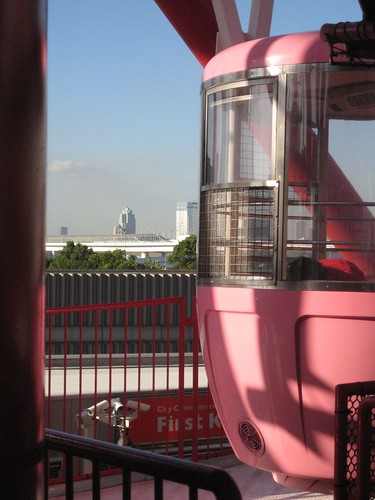

[**Code**](https://github.com/alexferdg/data-quality-engine/tree/main/captioning-data-engine)

**Original Caption:** dog in car

**CogVLM2-19B Caption:** a tranquil suburban neighborhood on a bright day. - A modern sports car with a sleek design and shiny finish is parked on the right side of the road, its elongated headlights and curved windshield standing out. - To the left, a well-maintained lawn extends from the curb, dotted with lush shrubs and a variety of plants that add color and texture to the scene. - Nestled between the car and the greenery is a paved pathway that meanders through the garden, suggesting a walkway for residents. - In the background, a row of houses with pitched roofs and large windows can be seen, their brick facades and uniformity indicating a cohesive community. - The sky above is clear and bright, casting a soft light on the neighborhood, which gives the scene a warm and inviting feel. - There's a sense of stillness and orderliness, with no people or animals immediately visible, and no vehicles moving, suggesting a quiet moment captured in time. - The overall mood of the image is one of serenity and contentment, as if the neighborhood is basking in a sunny afternoon.

**InternVL2-8B Caption:** a sleek, white sports car parked on the side of a residential street. The car, with its glossy finish and low profile, exudes a sense of speed and luxury. The driver's door is open, revealing a glimpse of the interior and the person sitting inside, adding a dynamic element to the scene. The car is positioned near a well-maintained garden, with various shrubs and hedges neatly trimmed, providing a lush backdrop. The driveway leading to the car is lined with a neatly trimmed hedge, adding to the suburban charm. In the background, there are two houses with brick facades, typical of suburban architecture. The sky is clear, suggesting a bright and sunny day, and the overall mood of the image is one of serene suburban life with a touch of elegance.

---

**Original Caption:** Study in black and white

**CogVLM2-19B Caption:** a woodpecker perched on a moss-covered stump. The bird is predominantly black and white, with a distinct black cap and back, white cheeks, and a contrasting black and white striped pattern on its wings. It is positioned on a rough, textured stump, which is covered in patches of green moss. The stump is surrounded by a variety of seeds scattered on its surface. The backdrop is slightly blurred, indicating a natural setting, possibly a garden or forest, with hints of brown foliage. The lighting suggests it might be either early morning or late afternoon, casting a warm, golden hue over the scene. The overall mood of the image is serene and calm, capturing a moment of stillness in nature.

**InternVL2-8B Caption:** a small bird perched on a rock, with a striking black and white pattern on its feathers. The bird is positioned prominently in the center, facing slightly to the right. Its head and neck are predominantly black with white spots, while its underbelly and chest are white. The bird's beak is thin and pointed, ideal for pecking at food. The rock on which the bird is perched is large and textured, with patches of green moss, suggesting a natural, possibly damp environment. To the right of the bird, there are scattered seeds and shells, indicating that the bird might be foraging or resting after feeding. The background is softly blurred with warm, golden hues, suggesting the photo was taken during the golden hour, which adds a warm and serene atmosphere to the scene. The overall mood of the image is peaceful and tranquil, capturing a moment of quiet in nature.

---

**Original Caption:** A pink car on the ferris wheel in Odaiba.

**CogVLM2-19B Caption:** a serene outdoor setting where a bright pink and transparent capsule-like structure, possibly a ride or viewing platform, is suspended in mid-air, supported by a sturdy red arm. The capsule appears modern and is accompanied by a sleek, dark-colored metal railing that runs alongside, offering a sense of security. The environment is bathed in the soft glow of either early morning or late afternoon sunlight, casting long shadows and highlighting the capsule's vibrant color against the muted backdrop. In the distance, a line of tall buildings punctuates the horizon, suggesting the proximity of an urban area. The sky is clear with a few scattered clouds, and the overall mood of the image is one of calm and quiet anticipation.

**InternVL2-8B Caption:** a vibrant pink and silver tram with a transparent front, giving a clear view of the driver's cabin. The tram is stationed on a platform, with a metal railing in front of it. The tram's design features a smooth, curved body with a glossy finish, reflecting the sunlight. The tram is part of a larger tram system, as indicated by the red signage with white lettering that reads "Firstk..." in the background, suggesting it might be a tram station. The setting is outdoors, with a clear blue sky and a few scattered clouds. In the distance, a modern cityscape with high-rise buildings can be seen, adding to the urban atmosphere. The image conveys a sense of modernity and efficiency, with the tram poised for departure amidst the bustling city environment.

---

**Original Caption:** A bottle in the main door of Tiffany & Co.

**CogVLM2-19B Caption:** This image showcases a large, light-colored wall with a textured surface that resembles a concrete or stone facade. The wall is adorned with a vertically aligned, metallic sign that reads "TIFFANY & CO." Below the sign, on the left side of the image, there's a small, dark-colored object that appears to be a water bottle. The overall setting suggests an urban environment, possibly outside a high-end retail store. The mood conveyed by the image is one of minimalism and modern design.

**InternVL2-8B Caption:** a section of a stone wall with a smooth, beige surface. On the right side of the wall, there is a small, rectangular plaque with the text "TIFFANY & CO." engraved in a metallic finish. The plaque is slightly elevated from the wall surface, giving it a subtle three-dimensional appearance. Below the plaque, near the bottom right corner of the image, there is a small, orange object, which appears to be a plastic bottle with a label, resting on the ground. The overall scene is simple and minimalistic, with a focus on the textured wall and the plaque. The environment suggests an indoor setting, possibly in a commercial or corporate space, given the formal and elegant appearance of the plaque. The lighting is even, indicating an indoor environment with artificial lighting. The mood of the image is calm and professional.

---

**Original Caption:** This holy animal is called Kylin, which looks like lion but not. It is a legend animal in Chinese fairy tale.

**CogVLM2-19B Caption:** a meticulously crafted bronze sculpture of a mythical creature, possibly a lion or dragon, set against an ornate background with intricate carvings. The creature is prominently displayed, with its roaring mouth, sharp fangs, and ornamental mane, capturing a sense of majesty and power. The bronze has a rich, golden hue, highlighting the detailed texture of the creature's fur and facial features. In the background, there are blurred structures that suggest an indoor setting, possibly a temple or historical building, with traditional architectural elements visible. The warm lighting casts a serene ambiance, emphasizing the depth and dimension of the sculpture.

**InternVL2-8B Caption:** a close-up of an ornate, golden lion's head sculpture. The sculpture is highly detailed, with visible textures and patterns on its mane and face. The lion's mouth is slightly open, revealing its teeth, and it appears to be part of a larger structure, possibly a gate or entrance. The background is blurred, but it appears to be an indoor setting with warm, ambient lighting that casts a soft glow on the sculpture. The overall mood of the image is one of grandeur and elegance, highlighting the intricate craftsmanship of the sculpture.

---

**Original Caption:** granite in green glass

**CogVLM2-19B Caption:** a modern glass building facade with numerous windows reflecting the surrounding environment. - The most prominent feature is the large, intricately designed yellow building reflected in the windows of the current building. Its design appears to be a mix of traditional and contemporary elements, with ornate details and a somewhat abstract form. The reflection is slightly distorted, adding an artistic touch to the scene. - The windows themselves are a large grid of square panes, divided by thin vertical and horizontal lines. They are made of clear glass, allowing for a crisp reflection of the surroundings. The glass has a smooth texture, and the panes are of varying sizes, creating a patterned appearance on the facade. - There are no people or moving objects visible in the reflection, giving a static quality to the scene. - The building itself has a sleek design with a metallic frame, and the windows have a slightly darker tint, possibly to reduce glare or heat. The building appears to be a contemporary structure, likely an office building or a residential complex. - The surrounding environment is not clearly visible due to the reflection, but the presence of the ornate building suggests that this could be in an urban setting with a mix of architectural styles. - The time of day is not explicitly clear, but the lighting suggests that it might be either early morning or late afternoon when the sun is not directly overhead, casting softer shadows. - The overall mood of the image is calm and serene, with the stillness of the reflection and the muted colors of the building and sky contributing to a peaceful atmosphere.

**InternVL2-8B Caption:** a large, abstract painting on the glass facade of a modern building. The painting is predominantly yellow and green with some white and black accents, creating a vibrant and somewhat chaotic visual effect. The texture of the painting appears to be thick and expressive, with visible brushstrokes and layering of colors. The painting is situated on a glass pane that is part of a larger window, which is composed of numerous smaller rectangular sections. The reflections of surrounding buildings and structures are faintly visible through the glass, adding depth to the image. The overall mood of the image is dynamic and artistic, capturing the interaction between the natural light and the colorful artwork.

---

**Original Caption:** An Angel of fortune on paper framed in black box frame. Credit to Logical1 for the pic :)

**CogVLM2-19B Caption:** a young individual standing contemplatively against a textured backdrop of what appears to be a wall or canvas. The individual's posture suggests introspection or deep thought. The backdrop has a weathered texture with visible lines and patterns, giving it an aged or vintage feel. A distinct color palette is used, with shades of blue and purple dominating the scene, adding a sense of calmness and mystery. The overall mood of the image is one of quiet reflection and serenity. The subject's placement against the rustic background creates a contrast that emphasizes the theme of youth meeting age, or the transient nature of time. The absence of other people or objects in the frame centers the viewer's attention solely on the individual, inviting them to ponder the story or emotions behind the moment captured.

**InternVL2-8B Caption:** a framed artwork depicting a figure in a dark, somewhat abstract style. The most prominent object is a central character with a yellowish hue, possibly an angel or mythical being, holding a scepter. This figure is surrounded by smaller, darker figures, adding to the sense of a mythical or fantastical scene. The background features a collage of text and images, giving it a layered, textured appearance. The colors are muted with shades of blue, pink, and gray, contributing to a somewhat ethereal and mysterious mood. The artwork is set within a black frame, which contrasts sharply with the lighter background, drawing attention to the intricate details within the piece.

---

**Original Caption:** I love the flashes of red felt against the stark black &amp;amp; white.

**CogVLM2-19B Caption:** a close-up view of a piano keyboard, with each key prominently displayed. The keys are arranged in a sequence of white and black keys, alternating in color. The keys are rectangular in shape, with black keys having white lettering on them. The piano has a glossy finish, reflecting light, and is set against a backdrop of a warm, wooden surface. The overall mood of the image is serene and elegant, emphasizing the beauty and intricacy of the instrument.

**InternVL2-8B Caption:** a close-up view of a grand piano, with a focus on its keys and the upper part of the instrument. The piano has black keys and white keys, which are intricately arranged and appear to be in excellent condition. The black parts of the piano, including the keys and the body, have a glossy finish, reflecting some light and giving a sleek, polished look. The white keys are clean and well-maintained, with no visible scratches or wear. The top of the piano has a reflective black surface, which might be made of wood or a high-quality synthetic material. There is a small, rectangular sticker or label visible on the top, possibly indicating the brand or model of the piano. The background is blurred but appears to be an indoor setting, suggesting that the piano is placed in a room with neutral-colored walls and possibly some ambient lighting. The overall mood of the image is one of elegance and sophistication, highlighting the beauty and craftsmanship of the piano. The close-up view emphasizes the precision and detail of the instrument, inviting viewers to appreciate its design and potential for creating beautiful music.

---

**Original Caption:** glass styles over red background

**CogVLM2-19B Caption:** a vibrant red background, upon which eight text elements are prominently displayed. Each text is labeled with a unique identifier that starts with "glasso" followed by a number, ranging from "1" to "8". The texts vary in color and style, with "glasso1" and "glasso5" appearing in a lighter, almost white shade, while "glasso2" and "glasso6" have a gradient effect transitioning from a deeper red to a lighter one. "Glasso3" and "Glasso7" are in a darker, almost black shade, and "Glasso4" and "Glasso8" are a mix of both dark and light red, creating a sense of depth and dimension. The boldness and size of the text differ, with some appearing larger and bolder than others. The overall mood of the image is playful and creative, suggesting a sense of diversity and variety within a unified theme.

**InternVL2-8B Caption:** a grid of eight stylized text boxes with a metallic appearance, each containing a unique combination of letters "glass" followed by a number from 01 to 08. The text boxes are arranged in two rows and four columns, creating a structured layout. The background is a rich, red color with a subtle, textured pattern that enhances the metallic sheen of the text boxes. The metallic texture of the text boxes gives them a three-dimensional, reflective quality. The overall image is vibrant and modern, with a clean and organized feel.

---

**Original Caption:** Summer green hill in Romania.

**CogVLM2-19B Caption:** a serene countryside landscape under a clear sky with a few clouds scattered around. The vast expanse of green grassland stretches out to rolling hills that are interspersed with clusters of trees, casting shadows that add depth to the scene. On the right, a cluster of trees stands tall, and in the distance, a small group of houses can be seen nestled among the hills. The gentle slopes and the undulating terrain create a rhythmic pattern, with the foreground being dominated by a large open field that gradually gives way to the more detailed middle ground. The overall mood of the image is one of tranquility and natural beauty, with the colors of the grass and the trees providing a warm and inviting atmosphere.

**InternVL2-8B Caption:** a serene landscape scene, primarily featuring a large, gently rolling hill in the foreground. The hill is covered in lush, green grass, with some areas showing yellowish hues, indicating the presence of wildflowers or different types of vegetation. At the base of the hill, there are a few small structures, possibly houses or barns, scattered sparsely, adding a touch of human habitation to the natural setting. In the background, a series of smaller hills and mountains rise up, creating a layered, hazy effect due to the mist or low-lying clouds. The sky above is overcast, with thick, gray clouds covering most of the view, suggesting a cloudy or gloomy day. The light appears soft and diffused, likely due to the cloud cover, which adds to the tranquil and somewhat somber mood of the scene. The overall feeling conveyed by the image is one of peaceful solitude and natural beauty, with the expansive green fields and rolling hills evoking a sense of calm and quiet. The interaction between the natural elements and the subtle human presence creates a harmonious balance, emphasizing the beauty of the countryside.

---

**Original Caption:** Guitar leaning on a tree on an island on O.S.A. lake in Killarney Provincial Park.

**CogVLM2-19B Caption:** a guitar headstock resting against a tree trunk. The headstock is predominantly green, with gold tuning pegs and a metallic silver finish on the three tuners. The strings are silver and appear to be in good condition. The tree trunk is textured with a mix of dark and light brown patterns, indicative of its bark. The surrounding environment is outdoors, with a hint of green foliage, suggesting a natural setting, possibly a park or forest. The lighting appears to be natural, with soft shadows suggesting it might be a calm day.

**InternVL2-8B Caption:** a green Phil® acoustic guitar leaning against a tree trunk. The guitar features a glossy finish with six strings, each held in place by golden tuning pegs. The brand name "Phil®" is prominently displayed in gold lettering on the headstock. The guitar's neck appears to be made of a darker wood, contrasting with the lighter body. The guitar's body has a distinctive circular pattern near the bottom, and the bridge is positioned towards the center of the body, connected to the tailpiece by a bridge pin. The guitar is situated outdoors, with sunlight filtering through the leaves, casting soft shadows on the guitar and the tree bark. The overall mood of the image is peaceful and serene, capturing a moment of quiet beauty in nature.

---

**Original Caption:** My next destination, this is at the bus stop near the M60 bridge on Greengate

**CogVLM2-19B Caption:** a bus stop sign. The most prominent element is a rectangular red sign with a white bus icon at the top and the words "Bus Stop" written below in white capital letters. Adjacent to this, there's a white sign with the name "Greengate Gardeners Arms" written in black. Below this, there's another white sign that reads "Towards Middleton" with the number "StopEB1138" underneath. There are also bus numbers listed below, specifically "80, 112, 118." The sign is affixed to a white pole with a red top. The background is overcast, suggesting a cloudy day. The sign is made of a smooth, possibly metallic material, with a matte finish. The pole has a cylindrical shape with a slightly flared top, and it is painted white with a red band at the top.

**InternVL2-8B Caption:** a bus stop sign. The most prominent object is the rectangular sign, predominantly white with a red top section that contains a simplified white bus icon and the words "Bus Stop" in black. Below this, the sign provides directions to "Greengate Gardener's Arms" and "Middleton" with the GMPTE logo in the bottom right corner. The sign also includes a set of three numbers: 80, 112, and 118, presumably bus routes, with "Towards" indicating the direction of these routes. The sign is mounted on a vertical pole, which is mostly white, with a small red section visible at the top right corner. The overall environment appears to be indoors, as the background is a plain, light-colored wall. The image conveys a sense of order and utility, typical of a public transportation setting.

---

**Original Caption:** The yellow stuff in the tree are lemons!

**CogVLM2-19B Caption:** a dusty, beige Mitsubishi car parked outdoors on a sunny day with clear blue skies and fluffy white clouds. The car has a license plate reading "FD 493" and a handwritten note on its rear that says "I ❤️ Devils," indicating a possible affection for a sports team or perhaps a local group or event. The car appears to be stationary, with no visible movement or activity around it. The surrounding area is lush and green, with a tall, leafy tree and a well-maintained lawn, suggesting a residential or park-like setting. The overall mood of the image is calm and serene, with the car and its surroundings bathed in warm sunlight.

**InternVL2-8B Caption:** a beige Mitsubishi car parked outdoors. The car's rear window is tinted, and its trunk features a large, prominent sticker with the text "I ♥ Devils" written in white. The car's license plate is visible, showing the registration "FD 493." The vehicle appears to be slightly dirty, suggesting it might not have been cleaned recently. Behind the car, there is a lush green bush with small yellow flowers, and further back, there is a building with a red brick facade and a white-framed window. The sky is partly cloudy, indicating a day with intermittent sunshine. The overall setting appears to be a residential area, likely in a suburban or semi-urban environment. The mood of the image is casual and somewhat quirky, given the humorous sticker on the car.

---

> **PROMPT:** Please generate a vivid and concise image caption in plain text, as if describing the scene to someone who cannot see it. 
> Start with "This image showcases..." and include the following elements: identify all objects from the most prominent to the smallest details, 
> describe their interactions or relationships (e.g., "a person standing next to a bicycle"), mention the color, size, texture, and any other relevant qualities of each object, 
> describe any actions taking place (e.g., "a dog running through a field"), provide context about the environment, such as indoors or outdoors, time of day, and weather conditions, 
> and convey the overall mood or feeling of the image, like a "peaceful sunset" or "chaotic street scene.